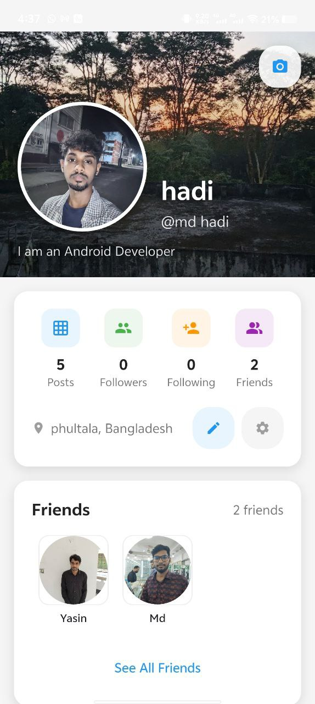

# ADDA - Social Media Platform

<div align="center">


**Connect, Share, and Engage with ADDA - Your Ultimate Social Experience**

[](https://flutter.dev)
[](https://firebase.google.com)
[](LICENSE)

</div>

## 📖 Overview

ADDA is a feature-rich social media application built with Flutter and Firebase, designed to provide users with a seamless and engaging social networking experience. With modern UI/UX and robust functionality, ADDA brings people together through interactive features and real-time communication.

## 🚀 Features

### 🔐 Authentication
- **Secure Login & Signup** with Firebase Authentication
- Email verification and password reset
- Social login integration (Google, Facebook)
- Biometric authentication support

### 🏠 Home & Feed
- Personalized news feed with smart algorithm
- Infinite scrolling with pagination
- Post reactions (Like, Comment, Share)
- Story viewing and creation
- Live streaming integration

### 👥 Social Features
- Friend request system
- Follow/Unfollow functionality
- User search and discovery
- Mutual friends display
- Connection recommendations

### 💬 Real-time Chat
- One-on-one messaging
- Group conversations
- Media sharing in chats
- Typing indicators
- Online status display

### 📹 Multimedia
- Video upload and streaming
- Image sharing with filters
- Story creation (24-hour disappearing content)
- Live streaming with real-time chat
- Media gallery integration

### 🔔 Notifications
- Real-time push notifications
- In-app notification center
- Customizable notification settings
- Friend request alerts
- Post interaction notifications

### 👤 Profile Management
- Customizable user profiles
- Profile picture and cover photo upload
- Bio and personal information
- Social links integration
- Privacy settings

### ⚙️ Settings & Customization
- Dark/Light theme toggle
- Language preferences
- Privacy controls
- Account management
- Data usage settings

## 🛠️ Tech Stack

- **Frontend**: Flutter 3.0+
- **Backend**: Firebase
- **Database**: Cloud Firestore
- **Authentication**: Firebase Auth
- **Storage**: Firebase Cloud Storage
- **Push Notifications**: FCM (Firebase Cloud Messaging)
- **State Management**: Provider/Bloc

## 📱 Screens

| Authentication | Home Feed | Profile |
|----------------|-----------|---------|
|  |  |  |

| Chat | Stories | Search |
|------|---------|--------|
|  |  |  |

## 🔧 Installation

### Prerequisites
- Flutter SDK 3.0+
- Dart 2.17+
- Android Studio/VSCode
- Firebase Account

### Steps

1. **Clone the repository**
   ```bash
   git clone https://github.com/Hadi2102060/social_media_adda.git
   cd social_media_adda

2. **Install dependencies**
 ```bash
   flutter pub get
```

3.  **Firebase Setup**

   - Create a new Firebase project

   -  Add Android and iOS apps

   - Download configuration files

   - Place google-services.json in android/app/

   - Place GoogleService-Info.plist in ios/Runner/

4. **Enable Firebase Services**

   - Authentication (Email/Password, Google)

   - Cloud Firestore

   - Cloud Storage

   - Cloud Messaging

5. **Run the app**

```bash

flutter run

```


## 🎯 Usage


 -**Sign Up/Login**: Create an account or login with existing credentials

 - ****************************Complete Profile**: Add profile picture and personal information

 - **Connect with Friends**: Search and send friend requests

 - **Share Content**: Create posts, upload photos and videos

 - **Engage**: Like, comment, and share others' content

 - **Chat**: Start real-time conversations with friends

 - **Go Live**: Start live streaming sessions

 - **Create Stories**: Share 24-hour disappearing content

## 🤝 Contributing

We welcome contributions! Please read our Contributing Guidelines for details.

Fork the project

 - Create your feature branch (git checkout -b feature/AmazingFeature)

 - Commit your changes (git commit -m 'Add some AmazingFeature')

 - Push to the branch (git push origin feature/AmazingFeature)

 - Open a Pull Request

## 📄 License

This project is licensed under the MIT License - see the LICENSE file for details.

## 📞 Support

 - Email: ug2102060@cse.pstu.ac.bd

 - Issues: GitHub Issues

 - Documentation: Project Wiki

## 🙏 Acknowledgments

 - Flutter team for the amazing framework

 - Firebase team for backend services

 - Contributors and testers